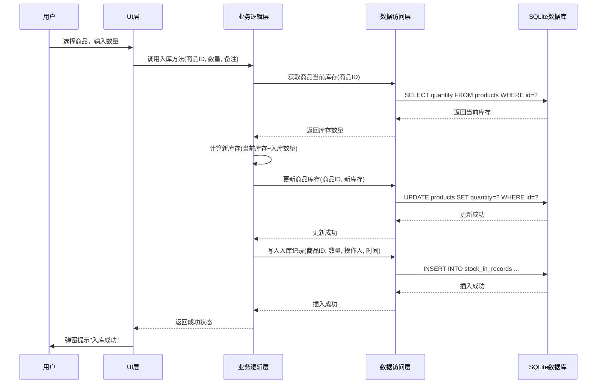
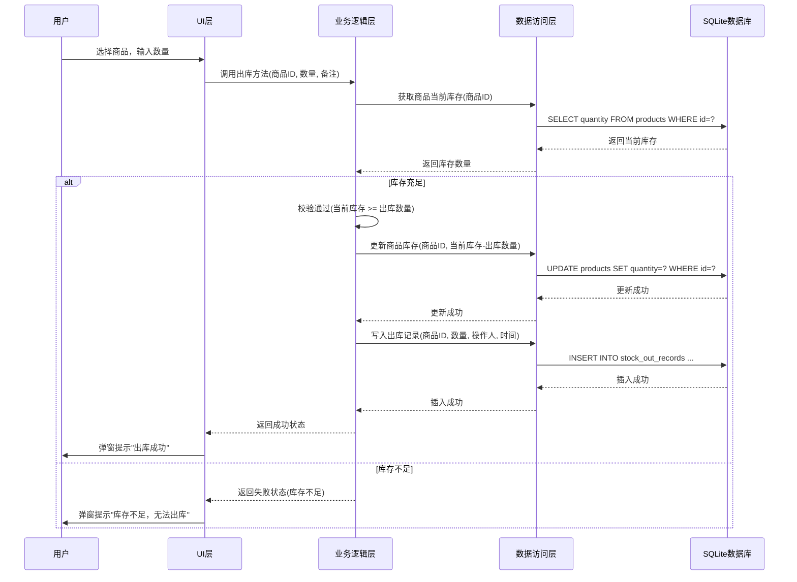
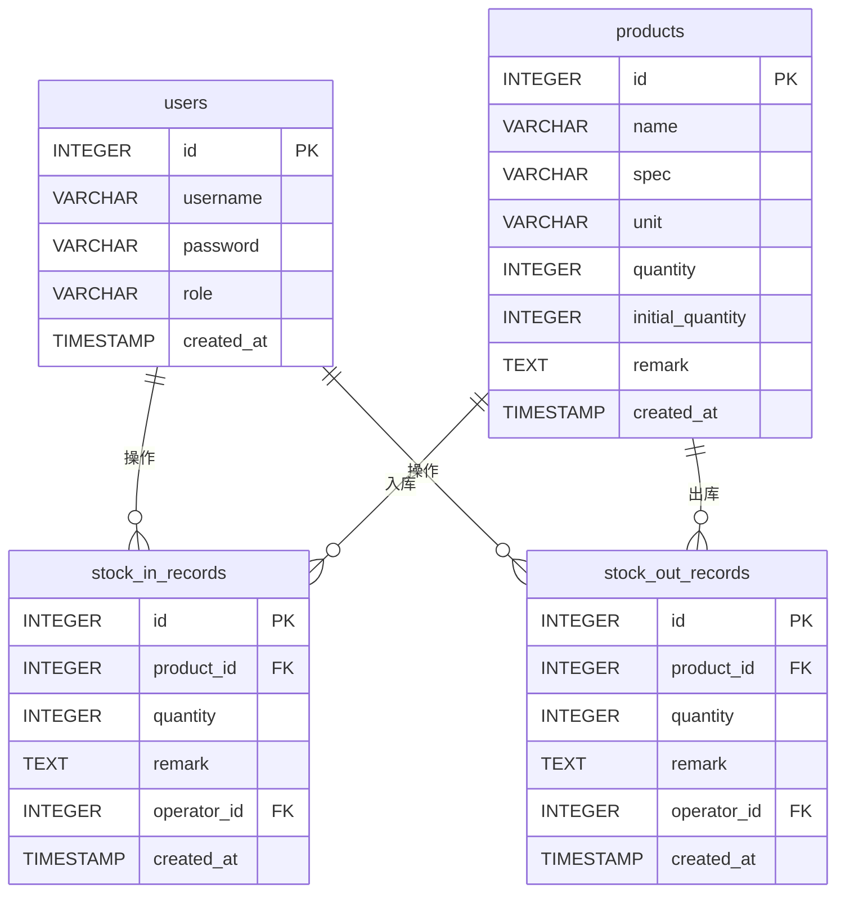

# 极简库存管理系统 - 技术设计文档

## 1. 技术选型

### 1.1 开发技术栈
| 分类 | 技术 | 版本 | 选型理由 |
|------|------|------|----------|
| 语言 | Python | 3.10+ | 语法简洁、生态成熟、跨平台支持好 |
| UI框架 | PyQt6 | 6.x | 成熟稳定、跨平台、原生桌面体验、文档丰富 |
| 数据库 | SQLite | 3.x | 嵌入式、轻量级、无需额外部署、性能优秀 |
| 报表导出 | openpyxl | 3.x | 成熟稳定、支持Excel文件读写 |
| 打包工具 | PyInstaller | 5.x | 支持生成Windows EXE安装包 |

### 1.2 依赖列表
```txt
PyQt6>=6.5.0
openpyxl>=3.1.2
sqlite3 (内置)
logging (内置)
zipfile (内置)
```

## 2. 技术架构设计

### 2.1 架构风格
采用分层架构（Layered Architecture），将系统分为四个层次，职责清晰，便于维护和扩展。

### 2.2 模块划分
| 层次 | 模块 | 职责描述 |
|------|------|----------|
| UI层 | `src/ui/` | 负责用户界面展示与交互，包含主窗口、对话框、表格组件等 |
| 业务逻辑层 | `src/business/` | 处理核心业务规则，如库存校验、权限控制、业务流程编排 |
| 数据访问层 | `src/data/` | 封装数据库操作，提供数据CRUD接口，使用DAO模式 |
| 工具层 | `src/utils/` | 提供通用工具函数，如报表导出、数据备份、日志处理等 |

### 2.3 数据流向
```
用户操作 → UI层 → 业务逻辑层 → 数据访问层 → SQLite数据库
                                   ↓
                              返回数据/状态
```

### 2.4 核心流程图（Mermaid）

#### 2.4.1 入库流程


#### 2.4.2 出库流程


## 3. 目录结构规范

```
SimpleStock/
├── src/                              # 源代码目录
│   ├── ui/                           # UI组件
│   │   ├── __init__.py
│   │   ├── main_window.py            # 主窗口
│   │   ├── login_dialog.py           # 登录对话框
│   │   ├── product_manage.py         # 商品管理界面
│   │   ├── stock_in_dialog.py        # 入库对话框
│   │   ├── stock_out_dialog.py       # 出库对话框
│   │   ├── inventory_query.py        # 库存查询界面
│   │   ├── ledger_view.py            # 台账查看界面
│   │   └── account_manage.py         # 账号管理界面
│   ├── business/                     # 业务逻辑
│   │   ├── __init__.py
│   │   ├── product_service.py        # 商品业务服务
│   │   ├── stock_service.py          # 库存业务服务
│   │   ├── ledger_service.py         # 台账业务服务
│   │   └── account_service.py        # 账号业务服务
│   ├── data/                         # 数据访问
│   │   ├── __init__.py
│   │   ├── db_connection.py          # 数据库连接管理
│   │   ├── product_dao.py            # 商品数据访问对象
│   │   ├── stock_dao.py              # 库存数据访问对象
│   │   ├── ledger_dao.py             # 台账数据访问对象
│   │   └── account_dao.py            # 账号数据访问对象
│   ├── utils/                        # 工具函数
│   │   ├── __init__.py
│   │   ├── excel_exporter.py         # Excel导出工具
│   │   ├── data_backup.py            # 数据备份工具
│   │   └── logger.py                 # 日志工具
│   ├── config/                       # 配置文件
│   │   ├── __init__.py
│   │   └── app_config.py             # 应用配置
│   └── __init__.py
├── tests/                            # 测试目录
│   ├── __init__.py
│   ├── test_product_service.py       # 商品业务测试
│   ├── test_stock_service.py         # 库存业务测试
│   └── test_account_service.py       # 账号业务测试
├── resources/                        # 静态资源
│   ├── icons/                        # 图标文件
│   └── styles/                       # 样式文件
├── main.py                           # 应用入口
├── requirements.txt                  # 依赖清单
└── README.md                         # 项目说明
```

## 4. 数据库设计

### 4.1 数据库初始化
系统首次启动时自动创建数据库并初始化默认数据：
- **默认管理员账号**：用户名 `admin`，密码 `admin123`（用户首次登录后应强制修改密码）

### 4.2 数据库表结构

#### 4.2.1 用户表（users）
| 字段名 | 类型 | 约束 | 说明 |
|--------|------|------|------|
| id | INTEGER | PRIMARY KEY AUTOINCREMENT | 用户ID |
| username | VARCHAR(50) | NOT NULL UNIQUE | 用户名 |
| password | VARCHAR(255) | NOT NULL | 密码（加密存储） |
| role | VARCHAR(20) | NOT NULL DEFAULT 'operator' | 角色（admin/operator） |
| created_at | TIMESTAMP | DEFAULT CURRENT_TIMESTAMP | 创建时间 |

#### 4.2.2 商品表（products）
| 字段名 | 类型 | 约束 | 说明 |
|--------|------|------|------|
| id | INTEGER | PRIMARY KEY AUTOINCREMENT | 商品ID |
| name | VARCHAR(100) | NOT NULL | 商品名称 |
| spec | VARCHAR(100) | | 规格型号 |
| unit | VARCHAR(20) | NOT NULL | 单位 |
| quantity | INTEGER | NOT NULL DEFAULT 0 | 当前库存 |
| initial_quantity | INTEGER | NOT NULL DEFAULT 0 | 初始库存 |
| remark | TEXT | | 备注 |
| created_at | TIMESTAMP | DEFAULT CURRENT_TIMESTAMP | 创建时间 |

#### 4.2.3 入库记录表（stock_in_records）
| 字段名 | 类型 | 约束 | 说明 |
|--------|------|------|------|
| id | INTEGER | PRIMARY KEY AUTOINCREMENT | 记录ID |
| product_id | INTEGER | NOT NULL FOREIGN KEY | 商品ID |
| quantity | INTEGER | NOT NULL | 入库数量 |
| remark | TEXT | | 备注 |
| operator_id | INTEGER | NOT NULL FOREIGN KEY | 操作人ID |
| created_at | TIMESTAMP | DEFAULT CURRENT_TIMESTAMP | 创建时间 |

#### 4.2.4 出库记录表（stock_out_records）
| 字段名 | 类型 | 约束 | 说明 |
|--------|------|------|------|
| id | INTEGER | PRIMARY KEY AUTOINCREMENT | 记录ID |
| product_id | INTEGER | NOT NULL FOREIGN KEY | 商品ID |
| quantity | INTEGER | NOT NULL | 出库数量 |
| remark | TEXT | | 备注 |
| operator_id | INTEGER | NOT NULL FOREIGN KEY | 操作人ID |
| created_at | TIMESTAMP | DEFAULT CURRENT_TIMESTAMP | 创建时间 |

### 4.3 数据库索引设计
为提升查询性能，创建以下索引：
| 表名 | 索引字段 | 索引类型 | 说明 |
|------|----------|----------|------|
| products | name | INDEX | 加速商品名称模糊查询 |
| products | id | PRIMARY KEY | 主键索引 |
| stock_in_records | product_id | INDEX | 加速按商品查询入库记录 |
| stock_in_records | created_at | INDEX | 加速按时间范围查询 |
| stock_out_records | product_id | INDEX | 加速按商品查询出库记录 |
| stock_out_records | created_at | INDEX | 加速按时间范围查询 |
| users | username | UNIQUE INDEX | 加速登录验证 |

### 4.4 数据库关系图


### 4.5 数据库操作事务规范
- **入库操作**：开启事务 → 更新商品库存 → 写入入库记录 → 提交事务（任一失败则回滚）
- **出库操作**：开启事务 → 校验库存 → 更新商品库存 → 写入出库记录 → 提交事务（任一失败则回滚）
- **商品删除**：检查库存和操作记录 → 删除商品（条件不满足则回滚）

## 5. API接口设计

### 5.1 商品服务接口

| 方法名 | 功能描述 | 参数 | 返回值 |
|--------|----------|------|--------|
| `add_product(name, spec, unit, initial_quantity, remark)` | 新增商品 | name: str, spec: str, unit: str, initial_quantity: int, remark: str | 商品ID |
| `update_product(product_id, name, spec, unit, remark)` | 更新商品 | product_id: int, name: str, spec: str, unit: str, remark: str | 布尔值 |
| `delete_product(product_id)` | 删除商品 | product_id: int | 布尔值（仅可删除无库存商品） |
| `get_product_by_id(product_id)` | 根据ID查询商品 | product_id: int | 商品对象或None |
| `search_products(keyword)` | 模糊查询商品 | keyword: str | 商品列表 |
| `get_all_products()` | 获取所有商品 | 无 | 商品列表 |

### 5.2 库存服务接口

| 方法名 | 功能描述 | 参数 | 返回值 |
|--------|----------|------|--------|
| `stock_in(product_id, quantity, remark, operator_id)` | 入库操作 | product_id: int, quantity: int, remark: str, operator_id: int | 布尔值 |
| `stock_out(product_id, quantity, remark, operator_id)` | 出库操作 | product_id: int, quantity: int, remark: str, operator_id: int | 布尔值（库存不足返回False） |
| `get_stock_by_product_id(product_id)` | 获取商品库存 | product_id: int | 库存数量 |

### 5.3 台账服务接口

| 方法名 | 功能描述 | 参数 | 返回值 |
|--------|----------|------|--------|
| `get_all_records(start_date, end_date)` | 获取台账记录 | start_date: str, end_date: str | 记录列表 |
| `get_stock_in_records(start_date, end_date)` | 获取入库记录 | start_date: str, end_date: str | 入库记录列表 |
| `get_stock_out_records(start_date, end_date)` | 获取出库记录 | start_date: str, end_date: str | 出库记录列表 |
| `export_to_excel(records, file_path)` | 导出Excel | records: list, file_path: str | 布尔值 |

### 5.4 账号服务接口

| 方法名 | 功能描述 | 参数 | 返回值 |
|--------|----------|------|--------|
| `login(username, password)` | 用户登录 | username: str, password: str | 用户对象或None |
| `change_password(user_id, old_password, new_password)` | 修改密码 | user_id: int, old_password: str, new_password: str | 布尔值 |
| `add_operator(username, password)` | 添加操作员 | username: str, password: str | 用户ID |
| `delete_operator(user_id)` | 删除操作员 | user_id: int | 布尔值 |
| `get_all_operators()` | 获取所有操作员 | 无 | 操作员列表 |

## 6. 编码规范

### 6.1 Python代码规范
- 遵循 **PEP 8** 代码风格指南
- 使用 **类型提示（Type Hints）**
- 采用 **Google风格** 或 **NumPy风格** 的代码文档注释
- 函数/方法长度控制在 **50行以内**，遵循单一职责原则
- 使用 **snake_case** 命名变量和函数
- 使用 **PascalCase** 命名类

### 6.2 日志规范
- 日志级别：DEBUG（开发调试）、INFO（正常操作）、WARNING（警告信息）、ERROR（错误信息）
- 日志格式：`{时间戳} | {级别} | {模块} | {操作人} | {描述} | {异常信息}`
- 日志存储：本地文件存储，按日期自动分割，保留最近30天日志
- 日志路径：`{应用目录}/logs/`

### 6.3 错误处理规范
- **数据层异常**：数据库连接失败、SQL执行错误 → 弹窗提示用户并记录日志
- **业务层异常**：负库存出库、商品不存在、权限不足 → 弹窗提示用户，不记录日志（预期内异常）
- **系统级异常**：文件读写失败、资源加载失败 → 弹窗提示用户并记录详细日志

## 7. 数据备份与恢复

### 7.1 备份机制
- **备份格式**：SQLite数据库文件直接复制（.db文件）+ 配置文件打包（ZIP压缩）
- **备份路径**：默认`{应用目录}/backup/`，支持用户自定义
- **备份频率**：建议用户每周手动备份，系统每次启动时提醒上次备份时间

### 7.2 恢复流程
1. 关闭应用
2. 进入备份目录
3. 选择备份文件
4. 解压覆盖当前数据库
5. 重新启动应用

### 7.3 数据安全
- 数据库文件加密：SQLite支持加密扩展（可选）
- 操作日志不可篡改：所有操作记录写入后不可修改、不可删除
- 定期清理：支持手动清理过期操作记录（需管理员权限）

## 8. 安全设计

### 8.1 认证与授权
- 用户密码采用 **SHA-256** 加密存储
- 区分管理员和普通操作员权限
- 所有操作需登录后执行

### 8.2 数据保护
- 操作日志记录操作人、操作时间、操作内容
- 台账记录不可删除、不可修改
- 定期备份提醒

## 9. 部署与集成

### 9.1 开发环境
- Python 3.10+
- PyQt6 6.x
- SQLite 3.x

### 9.2 打包部署
- 使用PyInstaller生成Windows EXE安装包
- 打包命令示例：
  ```bash
  pyinstaller --onefile --windowed --icon=resources/icons/app.ico main.py
  ```

### 9.3 运行环境要求
- Windows 10及以上版本（32位/64位）
- CPU：Intel i3及以上
- 内存：4GB及以上
- 磁盘空间：100MB及以上
