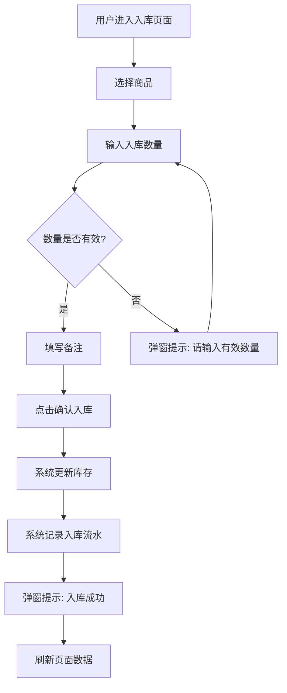
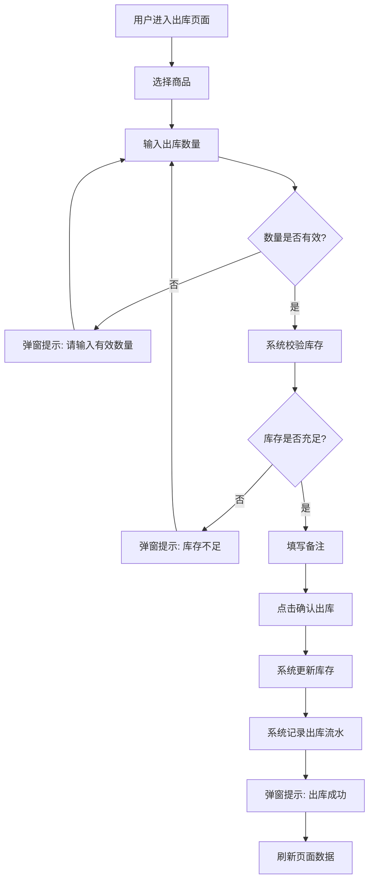
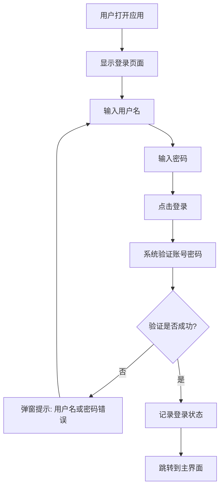

# 极简库存管理系统 - UI/交互设计文档

## 1. 设计原则

### 1.1 核心设计理念
- **简洁高效**：摒弃冗余元素，聚焦核心功能，让用户快速完成操作
- **直观易用**：符合Windows桌面应用的操作习惯，降低学习成本
- **专业稳重**：采用商务风格设计，体现数据管理系统的专业性

### 1.2 设计约束
- 适配Windows 10及以上版本
- 支持不同分辨率屏幕（1024x768及以上）
- 单次出入库操作≤3步

## 2. 界面布局规范

### 2.1 整体布局结构
采用经典Windows桌面应用布局：
```
┌─────────────────────────────────────────────────────────────────┐
│  顶部菜单栏（文件、编辑、帮助）                                  │
├─────────────┬───────────────────────────────────────────────────┤
│  左侧导航栏  │                                                 │
│  ├─ 商品管理 │                                                 │
│  ├─ 入库管理 │                    主内容区                      │
│  ├─ 出库管理 │                                                 │
│  ├─ 库存查询 │                                                 │
│  ├─ 台账报表 │                                                 │
│  └─ 账号管理 │                                                 │
└─────────────┴───────────────────────────────────────────────────┘
```

### 2.2 布局参数
- 左侧导航栏宽度：180px
- 顶部菜单栏高度：30px
- 主内容区边距：16px
- 控件间距：8px/16px/24px

## 3. 视觉风格规范

### 3.1 色彩方案
| 颜色用途 | 颜色值 | 说明 |
|----------|--------|------|
| 主色调 | #1E88E5 | 专业稳重的蓝色，用于按钮、选中状态 |
| 背景色 | #F5F5F5 | 浅灰色，用于主内容区背景 |
| 卡片背景 | #FFFFFF | 白色，用于表单卡片 |
| 文字颜色 | #333333 | 深灰色，用于主要文字 |
| 次要文字 | #666666 | 中灰色，用于次要文字 |
| 边框颜色 | #E0E0E0 | 浅灰色，用于分隔线、边框 |
| 成功色 | #4CAF50 | 绿色，用于成功提示 |
| 警告色 | #FF9800 | 橙色，用于警告提示 |
| 错误色 | #F44336 | 红色，用于错误提示 |

### 3.2 字体规范
| 字体用途 | 字体名称 | 字号 | 说明 |
|----------|----------|------|------|
| 标题 | 微软雅黑 | 18px | 页面标题 |
| 表单标签 | 微软雅黑 | 14px | 输入框标签 |
| 表单输入 | 微软雅黑 | 14px | 输入框内容 |
| 按钮文字 | 微软雅黑 | 14px | 按钮文字 |
| 表格内容 | 微软雅黑 | 13px | 表格数据 |
| 辅助文字 | 微软雅黑 | 12px | 提示、说明文字 |

### 3.3 图标规范
- 使用Qt内置图标或Font Awesome图标库
- 图标尺寸：16x16px（小）、24x24px（中）、32x32px（大）
- 图标颜色：正常状态#666666，悬停状态#1E88E5

## 4. 页面设计

### 4.1 登录页面

#### 4.1.1 布局设计
```
┌──────────────────────────────────────┐
│           极简库存管理系统            │
│              (Logo区域)              │
├──────────────────────────────────────┤
│  ┌────────────────────────────────┐  │
│  │ 用户名: [___________________]  │  │
│  │                                │  │
│  │ 密码:   [___________________]  │  │
│  │                                │  │
│  │  [登录按钮]    [重置按钮]       │  │
│  └────────────────────────────────┘  │
│           (错误提示区域)             │
└──────────────────────────────────────┘
```

#### 4.1.2 交互设计
- 输入框获得焦点时边框高亮显示
- 点击登录按钮或按Enter键触发登录验证
- 登录失败时显示红色错误提示
- 支持密码可见/隐藏切换

### 4.2 主窗口

#### 4.2.1 顶部菜单栏
| 菜单 | 子菜单项 | 功能说明 |
|------|----------|----------|
| 文件 | 数据备份 | 执行数据备份操作 |
| 文件 | 数据恢复 | 执行数据恢复操作 |
| 文件 | 退出 | 退出应用程序 |
| 编辑 | 修改密码 | 打开密码修改对话框 |
| 帮助 | 关于 | 显示关于信息 |

#### 4.2.2 左侧导航栏
| 导航项 | 图标 | 功能说明 |
|--------|------|----------|
| 商品管理 | 📦 | 管理商品信息 |
| 入库管理 | ➕ | 执行入库操作 |
| 出库管理 | ➖ | 执行出库操作 |
| 库存查询 | 🔍 | 查询库存数据 |
| 台账报表 | 📊 | 查看台账和导出报表 |
| 账号管理 | 👤 | 管理用户账号（仅管理员） |

### 4.3 商品管理页面

#### 4.3.1 布局设计
```
┌─────────────────────────────────────────────────────────────┐
│  商品管理                    [新增商品]                      │
├─────────────────────────────────────────────────────────────┤
│  搜索: [______________]  [搜索按钮]                          │
├─────────────────────────────────────────────────────────────┤
│  ┌──────────┬──────────┬──────────┬──────────┬────────┐    │
│  │ 商品名称 │   规格    │   单位   │ 当前库存 │ 操作   │    │
│  ├──────────┼──────────┼──────────┼──────────┼────────┤    │
│  │ 商品A    │ 规格A    │ 件       │ 100      │ 编辑 删除 │    │
│  │ 商品B    │ 规格B    │ 个       │ 50       │ 编辑 删除 │    │
│  └──────────┴──────────┴──────────┴──────────┴────────┘    │
└─────────────────────────────────────────────────────────────┘
```

#### 4.3.2 交互设计
- 输入关键词实时筛选商品列表
- 点击编辑按钮打开编辑对话框
- 点击删除按钮弹出确认对话框（仅无库存商品可删除）
- 列表支持按列排序

### 4.4 入库管理页面

#### 4.4.1 布局设计
```
┌─────────────────────────────────────────────────────────────┐
│  入库管理                                                   │
├─────────────────────────────────────────────────────────────┤
│  ┌──────────────────────────────────────────────────────┐   │
│  │ 商品选择: [下拉选择框]                                │   │
│  │                                                      │   │
│  │ 入库数量: [________]  (当前库存: XXX)                 │   │
│  │                                                      │   │
│  │ 备注:                                                │   │
│  │ [________________________________________________]   │   │
│  │                                                      │   │
│  │              [确认入库]  [重置]                       │   │
│  └──────────────────────────────────────────────────────┘   │
├─────────────────────────────────────────────────────────────┤
│  入库记录                                                  │
│  ┌──────────┬──────────┬──────────┬──────────┬────────┐    │
│  │ 商品名称 │ 入库数量 │   备注    │ 操作人   │ 时间   │    │
│  ├──────────┼──────────┼──────────┼──────────┼────────┤    │
│  │ 商品A    │ 50       │ 采购入库  │ admin    │ ...    │    │
│  └──────────┴──────────┴──────────┴──────────┴────────┘    │
└─────────────────────────────────────────────────────────────┘
```

#### 4.4.2 交互设计
- 下拉选择框支持输入关键词搜索商品
- 数量输入框仅允许输入正整数
- 点击确认入库按钮验证并提交
- 成功后弹窗提示并刷新库存显示

### 4.5 出库管理页面

#### 4.5.1 布局设计
```
┌─────────────────────────────────────────────────────────────┐
│  出库管理                                                   │
├─────────────────────────────────────────────────────────────┤
│  ┌──────────────────────────────────────────────────────┐   │
│  │ 商品选择: [下拉选择框]                                │   │
│  │                                                      │   │
│  │ 出库数量: [________]  (当前库存: XXX)                 │   │
│  │                                                      │   │
│  │ 备注:                                                │   │
│  │ [________________________________________________]   │   │
│  │                                                      │   │
│  │              [确认出库]  [重置]                       │   │
│  └──────────────────────────────────────────────────────┘   │
├─────────────────────────────────────────────────────────────┤
│  出库记录                                                  │
│  ┌──────────┬──────────┬──────────┬──────────┬────────┐    │
│  │ 商品名称 │ 出库数量 │   备注    │ 操作人   │ 时间   │    │
│  ├──────────┼──────────┼──────────┼──────────┼────────┤    │
│  │ 商品A    │ 20       │ 销售出库  │ operator │ ...    │    │
│  └──────────┴──────────┴──────────┴──────────┴────────┘    │
└─────────────────────────────────────────────────────────────┘
```

#### 4.5.2 交互设计
- 下拉选择框支持输入关键词搜索商品
- 数量输入框仅允许输入正整数，且不能超过当前库存
- 点击确认出库按钮验证库存并提交
- 库存不足时弹窗警告并拦截操作

### 4.6 库存查询页面

#### 4.6.1 布局设计
```
┌─────────────────────────────────────────────────────────────┐
│  库存查询                    实时库存统计                    │
│                             商品总数: XXX                   │
├─────────────────────────────────────────────────────────────┤
│  搜索: [______________]  [搜索按钮]                          │
├─────────────────────────────────────────────────────────────┤
│  ┌──────────┬──────────┬──────────┬──────────┐             │
│  │ 商品名称 │   规格    │   单位   │ 当前库存 │             │
│  ├──────────┼──────────┼──────────┼──────────┤             │
│  │ 商品A    │ 规格A    │ 件       │ 100      │             │
│  │ 商品B    │ 规格B    │ 个       │ 50       │             │
│  └──────────┴──────────┴──────────┴──────────┘             │
└─────────────────────────────────────────────────────────────┘
```

#### 4.6.2 交互设计
- 输入关键词实时筛选商品
- 列表支持按列排序
- 库存数据实时刷新

### 4.7 台账报表页面

#### 4.7.1 布局设计
```
┌─────────────────────────────────────────────────────────────┐
│  台账报表                                                  │
├─────────────────────────────────────────────────────────────┤
│  日期范围: [______]  至  [______]  [查询]  [导出Excel]       │
├─────────────────────────────────────────────────────────────┤
│  ┌──────────┬──────────┬──────────┬──────────┬──────────┐  │
│  │    时间   │ 类型     │ 商品名称 │ 数量     │ 操作人   │  │
│  ├──────────┼──────────┼──────────┼──────────┼──────────┤  │
│  │ 2024-01- │ 入库     │ 商品A    │ +50      │ admin    │  │
│  │ 15 10:00 │          │          │          │          │  │
│  │ 2024-01- │ 出库     │ 商品B    │ -20      │ operator │  │
│  │ 15 11:00 │          │          │          │          │  │
│  └──────────┴──────────┴──────────┴──────────┴──────────┘  │
└─────────────────────────────────────────────────────────────┘
```

#### 4.7.2 交互设计
- 日期选择框点击弹出日历选择器
- 点击查询按钮按日期范围筛选记录
- 点击导出Excel按钮生成Excel文件
- 记录按时间倒序排列

### 4.8 账号管理页面（管理员权限）

#### 4.8.1 布局设计
```
┌─────────────────────────────────────────────────────────────┐
│  账号管理                    [新增操作员]                     │
├─────────────────────────────────────────────────────────────┤
│  ┌──────────┬──────────┬──────────┬────────┐               │
│  │ 用户名   │ 角色     │ 创建时间 │ 操作   │               │
│  ├──────────┼──────────┼──────────┼────────┤               │
│  │ admin    │ 管理员   │ ...      │ (不可删)│               │
│  │ user1    │ 操作员   │ ...      │ 删除   │               │
│  └──────────┴──────────┴──────────┴────────┘               │
└─────────────────────────────────────────────────────────────┘
```

#### 4.8.2 交互设计
- 管理员账号不可删除
- 点击删除按钮弹出确认对话框
- 新增操作员需设置用户名和密码

## 5. 弹窗设计规范

### 5.1 弹窗类型
| 类型 | 图标 | 背景色 | 用途 |
|------|------|--------|------|
| 成功 | ✅ | #E8F5E9 | 操作成功提示 |
| 警告 | ⚠️ | #FFF3E0 | 操作警告提示 |
| 错误 | ❌ | #FFEBEE | 操作失败提示 |
| 确认 | ❓ | #E3F2FD | 确认操作提示 |

### 5.2 弹窗布局
```
┌─────────────────────────────┐
│  [图标]  标题               │
├─────────────────────────────┤
│         提示内容             │
├─────────────────────────────┤
│     [确认按钮]  [取消按钮]   │
└─────────────────────────────┘
```

## 6. 交互流程设计

### 6.1 入库流程


### 6.2 出库流程


### 6.3 登录流程


## 7. 快捷键设计

| 快捷键 | 功能 | 适用页面 |
|--------|------|----------|
| Ctrl+N | 新增商品/操作员 | 商品管理/账号管理 |
| Ctrl+S | 保存/提交 | 表单页面 |
| Ctrl+F | 搜索 | 列表页面 |
| Ctrl+B | 数据备份 | 所有页面 |
| Ctrl+Q | 退出应用 | 所有页面 |
| Enter | 确认/提交 | 登录、表单页面 |
| Escape | 关闭弹窗/取消 | 弹窗、表单页面 |
